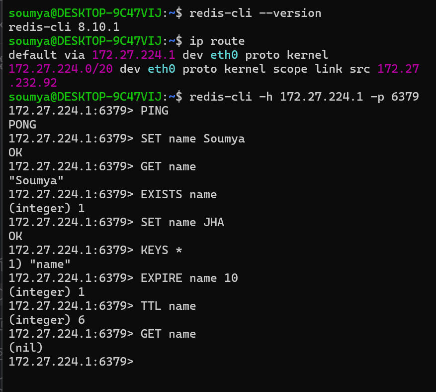

# Mini Redis Server in Java

A lightweight Redis-compatible server built from scratch in Java to understand how in-memory databases, TCP networking, command parsing, the RESP protocol, concurrency, expiration, and persistence work internally.

This project implements a practical subset of Redis functionality and can be tested using `redis-cli`.

---

## 📌 Project Goal

The goal of this project was not to recreate the entire Redis codebase.

Instead, it was built to understand how a real networked in-memory database works internally by implementing its core concepts from scratch in Java.

---
---
## 🚀 Features

- TCP server using Java `ServerSocket` and `Socket`
- RESP2 request parsing
- Multiple client connections using threads
- Thread-safe in-memory storage using `ConcurrentHashMap`
- Basic Redis commands:
  - `SET`
  - `GET`
  - `DEL`
  - `EXISTS`
  - `PING`
  - `KEYS`
  - `FLUSHALL`
  - `EXPIRE`
  - `TTL`
  - `QUIT`
- Key expiration with TTL
- File-based persistence
- Data restoration after server restart
- `redis-cli` compatibility
- JUnit test suite

---

> **Status:** Working educational implementation  
> **Compatibility:** Tested with `redis-cli 8.10.1`  
> **Tests:** 16 passing


## 🛠️ Tech Stack

- **Java 17**
- **Maven**
- **TCP/IP**
- **RESP2**
- **ConcurrentHashMap**
- **JUnit 5**
- **redis-cli**
- **Git & GitHub**

---

## 🏗️ Architecture

```text
                     ┌──────────────────┐
                     │     redis-cli     │
                     └────────┬─────────┘
                              │
                         TCP Connection
                              │
                              ▼
                     ┌──────────────────┐
                     │   RedisServer    │
                     │   Port: 6379     │
                     └────────┬─────────┘
                              │
                     accepts clients
                              │
                              ▼
                     ┌──────────────────┐
                     │  ClientHandler   │
                     │  One per client  │
                     └────────┬─────────┘
                              │
                              ▼
                     ┌──────────────────┐
                     │  CommandParser   │
                     │   RESP → args    │
                     └────────┬─────────┘
                              │
                              ▼
                     ┌──────────────────┐
                     │ CommandHandler   │
                     │ SET / GET / etc. │
                     └────────┬─────────┘
                              │
                              ▼
                  ┌────────────────────────┐
                  │   ConcurrentHashMap    │
                  │   Key → RedisEntry     │
                  └────────────┬───────────┘
                               │
                               ▼
                    ┌────────────────────┐
                    │ PersistenceManager │
                    │   redis-data.db    │
                    └────────────────────┘
```

---

## 🔄 How It Works

### 1. TCP Connection

The server listens on port `6379`.

```java
ServerSocket serverSocket =
        new ServerSocket(6379);
```

A client connects to the server using TCP.

```text
redis-cli → TCP → RedisServer
```

---

### 2. Client Handling

Whenever a client connects, the server creates a separate thread for that client.

```text
Client 1 → Thread 1
Client 2 → Thread 2
Client 3 → Thread 3
```

This allows multiple clients to communicate with the server concurrently.

---

### 3. RESP Protocol

Redis uses the **Redis Serialization Protocol (RESP)** to communicate between clients and servers.

For example:

```text
*3\r\n
$3\r\n
SET\r\n
$4\r\n
name\r\n
$6\r\n
Soumya\r\n
```

This represents:

```text
SET name Soumya
```

The `CommandParser` converts the RESP request into:

```text
["SET", "name", "Soumya"]
```

The `CommandHandler` then executes the command.

---

### 4. In-Memory Storage

Data is stored using:

``` java
ConcurrentHashMap<String, RedisEntry>
```


Conceptually:


`ConcurrentHashMap` allows multiple client threads to safely access the shared data structure.

---

### 5. Key Expiration

Keys can have an expiration time.

Example:

```text
SET name Soumya EX 10
```

The key will expire after approximately 10 seconds.

The server stores:

```text
value
expirationTime
```

Expired keys are removed when accessed.

---

### 6. Persistence

Although Redis primarily operates in memory, this project also implements simple file-based persistence.

Data is stored in:

```text
redis-data.db
```

The persistence manager:

- Saves data after supported mutating commands
- Loads existing data when the server starts
- Saves data when the server shuts down
- Ignores entries that have already expired

The database file is intentionally excluded from Git using `.gitignore`.

---

## 📋 Supported Commands

|   Command  |          Example        |           Description          |
|------------|-------------------------|--------------------------------|
|   `SET`    |    `SET name Soumya`    |         Stores a value         |
|  `SET EX`  | `SET name Soumya EX 60` | Stores a value with expiration |
|   `GET`    |       `GET name`        |        Retrieves a value       |
|   `DEL`    |       `DEL name`        |         Deletes a key          |
|  `EXISTS`  |      `EXISTS name`      |   Checks whether a key exists  |
|   `PING`   |         `PING`          |    Tests server connectivity   |
|   `KEYS`   |        `KEYS *`         |       Lists matching keys      |
| `FLUSHALL` |       `FLUSHALL`        |         Removes all keys       |
|  `EXPIRE`  |     `EXPIRE name 60`    |     Adds expiration to a key   |
|   `TTL`    |       `TTL name`        |    Returns remaining lifetime  |
|   `QUIT`   |         `QUIT`          |  Closes the client connection  |


### KEYS Pattern Support

The current implementation supports:

```text
*   → matches any number of characters
?   → matches one character
```

For example:

```text
KEYS user*
```

---

## 🧪 Testing

The project includes unit tests using JUnit 5.

Current test coverage:

```text
CommandHandlerTest      → 10 tests
PersistenceManagerTest  →  2 tests
RedisEntryTest          →  4 tests
-----------------------------------
Total                   → 16 tests
```

All tests currently pass:

```text
Tests run: 16
Failures: 0
Errors: 0
Skipped: 0

BUILD SUCCESS
```

Run the tests with:

```bash
mvn test
```

---

## ▶️ Running the Project

### Prerequisites

Make sure you have:

- Java 17+
- Maven
- Git

Optional:

- `redis-cli`

---

### 1. Clone the Repository

```bash
git clone <your-github-repository-url>
cd Mini_Redis
```

---

### 2. Build the Project

```bash
mvn clean package
```

---

### 3. Start the Server

```bash
java -cp target/classes Main
```

You should see:

```text
Loaded 0 entries from disk.
Redis server has started on port 6379
```

---

## 💻 Testing with redis-cli

If `redis-cli` is installed in the same environment as the server:

```bash
redis-cli -p 6379
```

Then try:

```text
PING
```

Response:

```text
PONG
```

### SET and GET

```text
SET name Soumya
GET name
```

Expected:

```text
"Soumya"
```

### EXISTS

```text
EXISTS name
```

Expected:

```text
(integer) 1
```

### DELETE

```text
DEL name
```

Expected:

```text
(integer) 1
```

### TTL

```text
SET name Soumya EX 10
TTL name
```

The TTL will return the remaining number of seconds.

### KEYS

```text
SET name Soumya
SET course Java
KEYS *
```

### FLUSHALL

```text
FLUSHALL
```

This removes all stored keys.

---

## 🪟 Windows + WSL Setup

If the Java server is running on Windows while `redis-cli` is running inside WSL, `localhost` may not point to the Windows server.

Find the Windows host gateway from WSL:

```bash
ip route | awk '/default/ {print $3}'
```

Then connect using:

```bash
redis-cli -h <gateway-ip> -p 6379
```

Example:

```bash
redis-cli -h 172.27.224.1 -p 6379
```

The server is bound to `0.0.0.0` so that connections from WSL can reach it.

---

## 📁 Project Structure

```text
Mini_Redis/
│
├── src/
│   ├── main/
│   │   └── java/
│   │       ├── Main.java
│   │       ├── RedisServer.java
│   │       ├── ClientHandler.java
│   │       ├── CommandParser.java
│   │       ├── CommandHandler.java
│   │       ├── RedisEntry.java
│   │       ├── PersistenceManager.java
│   │       └── RedisClient.java
│   │
│   └── test/
│       └── java/
│           ├── RedisEntryTest.java
│           ├── CommandHandlerTest.java
│           └── PersistenceManagerTest.java
│
├── pom.xml
├── .gitignore
└── README.md
```

---

## 🧩 Design Decisions

### ConcurrentHashMap

A `ConcurrentHashMap` is used instead of a normal `HashMap` because multiple client threads can access the database simultaneously.

### Thread-per-client

Each connected client gets its own thread.

This keeps the implementation simple while demonstrating concurrent client handling.

### Lazy Expiration

Expired keys are checked when accessed instead of continuously running a cleanup thread.

### File-based Persistence

A simple binary file is used instead of an external database to demonstrate how in-memory data can be persisted and restored.

### RESP2

The server implements the subset of RESP2 needed by the supported commands and `redis-cli`.

---

## ⚠️ Current Limitations

This project intentionally implements a subset of Redis rather than the complete Redis feature set.

Current limitations include:

- Only a subset of Redis commands is implemented
- `DEL` currently handles one key at a time
- `EXISTS` currently handles one key at a time
- `PING` currently supports the no-argument form
- `KEYS` supports simplified `*` and `?` patterns
- RESP parsing currently supports arrays of bulk strings
- Some malformed command arguments may return errors through exception handling rather than complete Redis-style validation
- Persistence is file-based and not equivalent to Redis RDB/AOF
- Thread-per-client architecture is intended for learning rather than production-scale workloads

---

## 🔮 Future Improvements

Possible future enhancements:

- `MGET` / `MSET`
- Multiple-key `DEL` and `EXISTS`
- `INCR` / `DECR`
- Lists and Sets
- Hash data structures
- Pub/Sub
- More complete RESP support
- Better command validation
- Improved persistence
- AOF-style logging
- Connection/thread management using thread pools
- Performance benchmarking
- Docker support

---

## 🎯 What I Learned

Through this project, I explored:

- How TCP client-server communication works
- Java `ServerSocket` and `Socket`
- Input and output streams
- RESP protocol and request framing
- Command parsing
- Concurrent data structures
- Multithreading
- Key expiration and TTL
- File-based persistence
- Unit testing with JUnit
- Maven project structure
- Redis client compatibility
- Debugging networking issues between Windows and WSL

## Demo:


## 📄 License

This project is intended for educational and portfolio purposes.